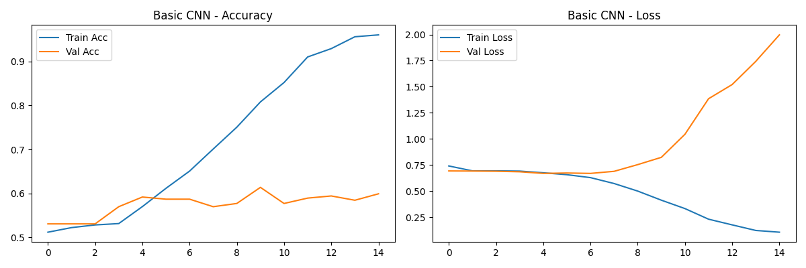
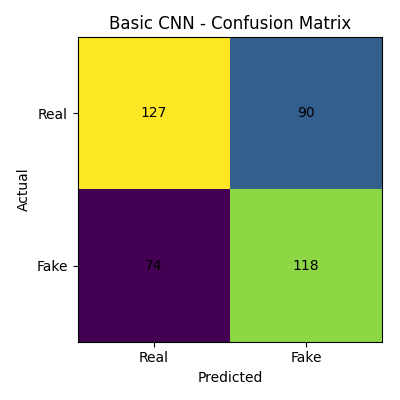
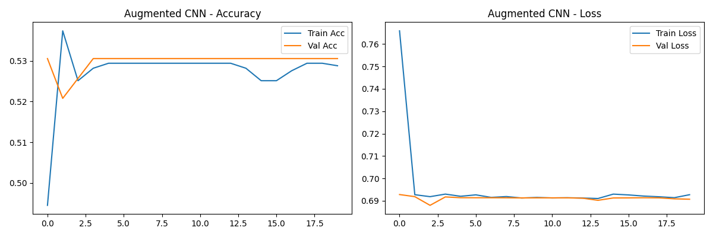
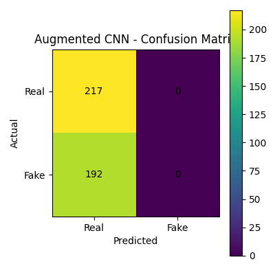
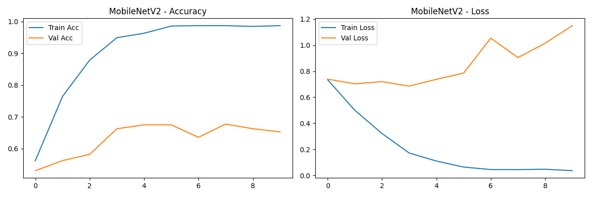
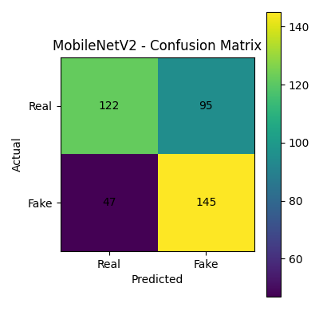
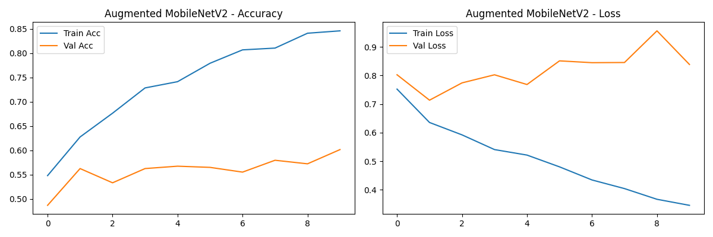
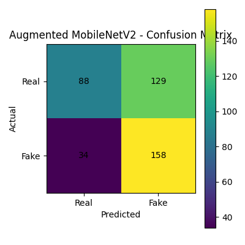

# Fake Face Detection

This project aims to detect **fake faces generated by expert photo editing** versus real human faces. The dataset contains **expert-level fake faces** that are more challenging than standard GAN-generated images.

**Dataset:** [Kaggle: Real and Fake Face Detection](https://www.kaggle.com/datasets/ciplab/real-and-fake-face-detection)

---

## Dataset Details

- **Total images:** 2041
  - Real: 1081
  - Fake: 960
- **Training samples:** 1632 (224x224x3)
- **Validation samples:** 409 (224x224x3)

Directory structure:

```
/real_and_fake_face/
    /training_real/
        real_00001.jpg
        real_00002.jpg
        ...
    /training_fake/
        easy_100_1111.jpg
        easy_101_0010.jpg
        ...
```

---

## Models and Results

We trained 4 different models on this dataset.

| Model                                               | Augmentation | Pretrained | Val Accuracy | Notes                                                          |
| --------------------------------------------------- | ------------ | ---------- | ------------ | -------------------------------------------------------------- |
| Basic CNN                                           | ❌           | ❌         | 60%          | Overfits, small network struggles to generalize                |
| CNN + Augmentation                                  | ✅           | ❌         | 59%          | Augmentation reduces overfitting but underfits hard fake faces |
| MobileNetV2                                         | ❌           | ✅         | 65%          | Transfer learning helps capture more complex features          |
| MobileNetV2 + Augmentation (Fine-tuned last layers) | ✅           | ✅         | 60–70%+      | Best model, balances generalization and feature extraction     |

**Classification Report for Final Model (Augmentation + MobileNetV2):**

```
precision    recall  f1-score   support

           0       0.72      0.41      0.52       217
           1       0.55      0.82      0.66       192

    accuracy                           0.60       409
   macro avg       0.64      0.61      0.59       409
weighted avg       0.64      0.60      0.59       409
```

---

## Training Curves and Confusion Matrices

### Basic CNN




### Augmented CNN




### MobileNetV2




### Augemnted MobileNetV2




---

## Future Work

- Try other pretrained models such as **ResNet50, EfficientNet, or DenseNet** to improve validation accuracy.
- Experiment with **different data augmentation strategies** to better handle subtle fake features.
- Increase dataset size or include **GAN-generated faces** for additional variety.
- Use **learning rate schedulers** and **early stopping** to reduce overfitting.

---

## Saved Models

All trained models are saved in the `trained_models/` directory:

```
trained_models/basic_cnn_fake_face.h5
trained_models/augmented_cnn_fake_face.h5
trained_models/augmented_mobilenetv2_finetuned_fake_face.h5
```

---

# IMPORTANT

Git LFS was used to store .h5 model files, so only use git clone to use the project.
